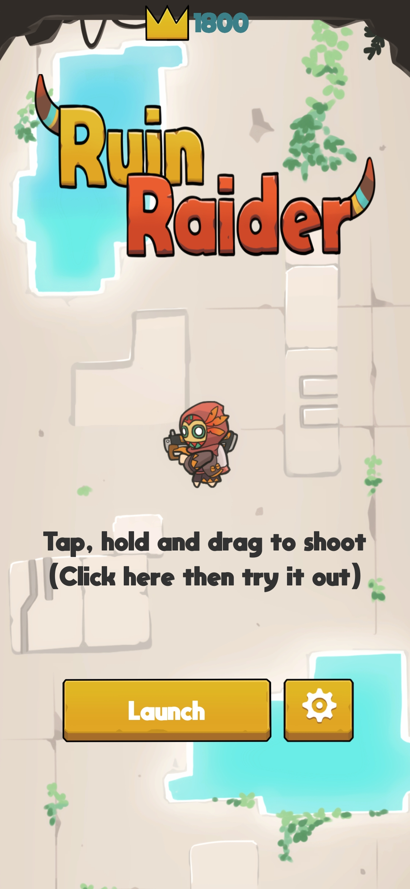
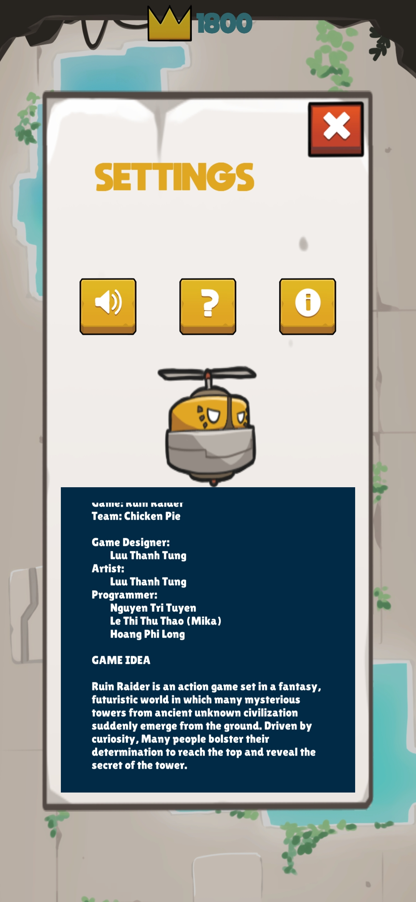
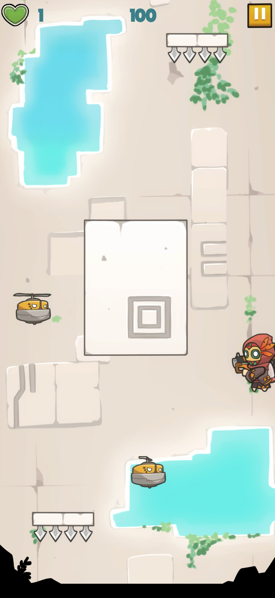
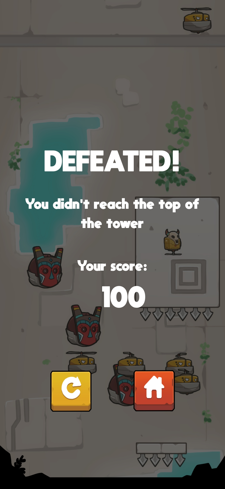
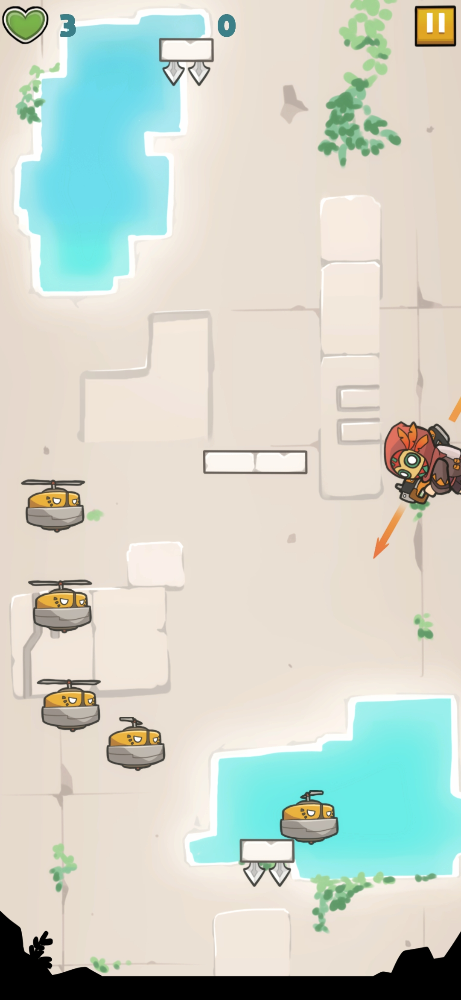

# HOANG PHI LONG — Game Developer
📍 [Hung Yen, Viet Nam] | 📧 [hoangphilong0506@gmail.com]

## 🚀 Technical Skills
* **Game Engines:** Unity
* **Languages:** C#, C++
* **Tools & Software:** Git/GitHub

---

## 🎮 Featured Projects

### 🕹️ Project 1: Ruin Raider
Just a simple side-scrolling shooter adventure game.

* **Engine/Tools:** Unity (C#)
* **Team: 3 devs + 1 gd in two weeks only at the night time :night_owls:
* **My Direct Contributions:**
  * Implemented enemies AI system: spawning, moving pattern

  
  
  
  
  

---

### 🕹️ Project 2: Symetry
A casual puzzle mini game 

* **Engine/Tools:** Unity (C#)
* **Team:** 2 devs working on free time in few weeks
* **My Direct Contributions:**
  * Move and flip puzzle pieces to create a symmetrical pattern

  
  
  
  

---

## 🧠 About Me
If I'm not eating or sleeping, I'm probably making games, playing games, or watching other people play games. ^^
