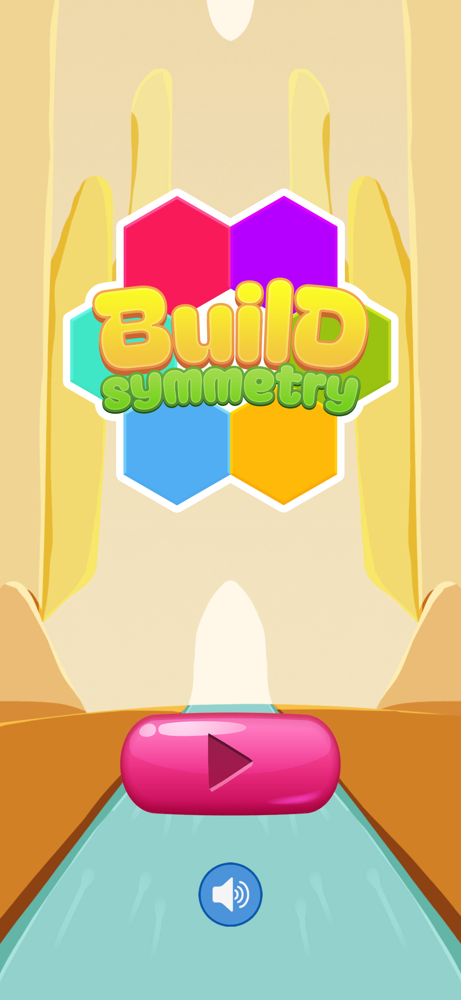
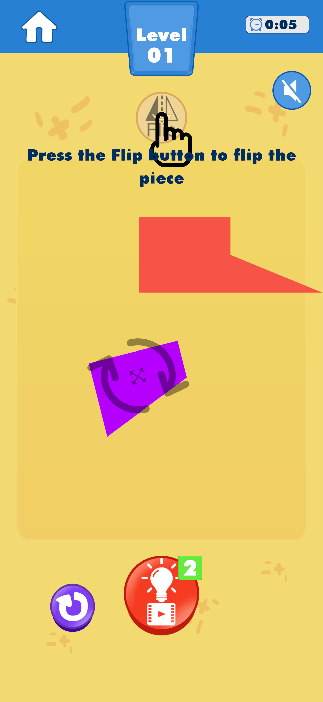
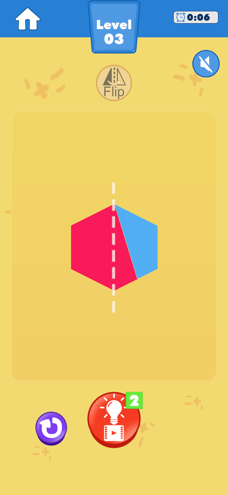

# HOANG PHI LONG — Game Developer
📍 [Hung Yen, Viet Nam] | 📧 [hoangphilong0506@gmail.com]

## 🚀 Technical Skills
* **Game Engines:** Unity
* **Languages:** C#, C++
* **Tools & Software:** Git/GitHub

---

## 🎮 Featured Projects

### 🕹️ Project 1: Ruin Raider
A simple side-scrolling shooter adventure game.

* **Engine/Tools:** Unity (C#)
* **Team:** 3 developers + 1 game designer, developed over 2 weeks (night-time only) 🦉
* **My Direct Contributions:**
  * Implemented enemies AI system: spawning, moving pattern

  
  
  
  
  

---

### 🕹️ Project 2: Symetry
A casual puzzle game where players move and flip puzzle pieces to create symmetrical patterns.

* **Engine/Tools:** Unity (C#)
* **Team:** 2 devs working on free time in few weeks
* **My Direct Contributions:**
  * Implemented the core gameplay mechanic for moving and flipping puzzle pieces to create symmetrical patterns.

  
  
  

---

### 🕹️ Project 3: 20 Minutes Till Dawn Gameplay Prototype
Recreated the core gameplay loop of 20 Minutes Till Dawn in Unity within a week

* **Team:** 2 devs
* **My Direct Contributions:**
  * Create enemies AI system: spawning, track and follow player, attack pattern
  * Player stats system: hp, dmg, level, exp,...
  * Some UI and animation

### Some small projects I cloned for learning purposes
* 2048 — Implemented grid movement, tile merging, animations, and score management.
* Tower Defense Prototype — Built enemy pathfinding, wave spawning, targeting, and tower upgrade systems.
* Match-3 Prototype — Implemented match detection, cascading, and board generation.

## 🧠 About Me
If I'm not eating or sleeping, I'm probably making games, playing games, or watching other people play games. ^^
